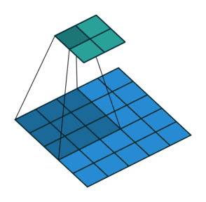
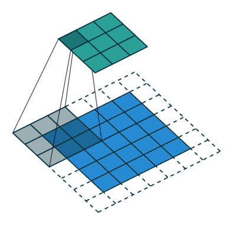
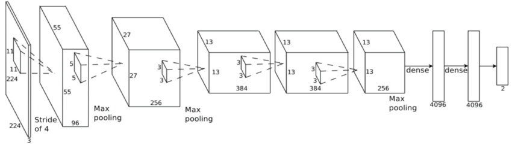

class: middle, center, inverse

# Introducción

---


## Repaso de Deep Learning

* Modelo principal: red profunda (**feed-forward**): composición de **proyecciones lineales** y **no-linealidades**

\begin{align}
h^{(i+1)} &= Wz^{(i)} + b   \\
z^{(i+1)} &= \sigma (h^{(i+1)}) \\
\end{align}

* Al final: añadir coste apropiado para regresión o clasificación.

* Las redes neuronales se conocen desde mediados del siglo XX, pero su fuerte resurgimiento no fue hasta esta década:

  * Paralelización en tarjetas gráficas (**GPUs**).
  
  * Librerías de **diferenciación automática**.

---

## Diferenciación Automática (AD) (1)

* ¿Cómo calcular el gradiente en una red profunda?

--

* **A mano**: no escala a nuevas arquitecturas, propenso a errores.

* **Diferenciación numérica**: acumulación de errores y elevado coste computacional.

\begin{equation}
\frac{\partial E_n}{\partial w_{ji}} = \frac{E_n(w_{ji} + \epsilon) - E_n(w_{ji} - \epsilon)}{2 \epsilon} + O(\epsilon^2)
\end{equation}

* **Diferenciación simbólica**: manipulación exacta de expresiones (mediante tablas de derivadas), pero explosión en la cantidad de términos:

<center>

</center>


---

## Diferenciación Automática (AD) (2)

* Surge la **diferenciación automática o algorítmica**: aplica diferenciación simbólica pero solo a expresiones simples, y al componerlas, actualiza los resultados numéricos parciales (que serán **exactos**)

* Ejemplo para calcular la derivada de $y = f(x_1, x_2) = \log (x_1) + x_1 x_2 - \sin (x_2)$ en $(x_1, x_2) = (2, 5)$:

<center>

</center>


---

## Diferenciación Automática (AD) (3)

* ¿Por qué **backpropagación**?

* Ejemplo: considera una serie de funciones $f : \mathbb{R}^n \rightarrow \mathbb{R}^m$,  $g : \mathbb{R}^m \rightarrow \mathbb{R}^m$ y $h : \mathbb{R}^m \rightarrow \mathbb{R}$. Queremos obtener la derivada de su composición, $\frac{\partial (h \circ g \circ f)}{\partial x}$


* Queda que 

\begin{equation}
\frac{\partial (h \circ g \circ f)}{\partial x} = \frac{\partial h}{\partial g} \frac{\partial g}{\partial f} \frac{\partial f}{\partial x}
\end{equation}

* Asociando $\frac{\partial h}{\partial g} ( \frac{\partial g}{\partial f} \frac{\partial f}{\partial x} )$, queda un producto matriz-matriz y otro producto vector-matriz.

* Asociando $( \frac{\partial h}{\partial g} \frac{\partial g}{\partial f} )\frac{\partial f}{\partial x}$, ¡solo hay que hacer productos vector-matriz!: mucho más eficiente.

--

* En ML es habitual optimizar funciones de tipo $\mathbb{R}^d \rightarrow \mathbb{R}$, por tanto es más eficiente propagar los gradientes hacia atrás (**backpropagation**) que hacia adelante (**forward propagation**).


---


## Optimizando mediante SGD o Adam.

* Una vez hemos calculado el gradiente en un punto mediante AD, las opciones actuales más populares son

* **Descenso por el gradiente estocástico** (SGD): ya visto, estimación usando mini-batches.

* **Adam** (2014: https://arxiv.org/abs/1412.6980) : corrige el gradiente estimando una ventana móvil de su media y de su varianza.


<center>

</center>


---

## Volviendo a Deep Learning


* Ya tenemos todos los ingredientes:

  * Datasets enormes.

  * Redes neuronales como **aproximadores universales**.
  
  * Librerías para **diferenciación automática**: tensorflow, keras, pytorch...
  
  * Potentes CPUs o GPUs para **paralelizar a lo largo de cada ejemplo del mini-batch**.
  
* ¿Qué falta en muchas ocasiones?

--

  * Solo teóricamente las redes neuronales son totalmente expresivas.
  
  * Conviene añadir un **sesgo inductivo** (**inductive bias**) para ayudar al aprendizaje:
  
      * Imágenes, señales: invarianza a traslaciones, escala: **redes convolucionales**.
    
      * Texto, secuencias: sensibilidad al orden de los símbolos: **redes recurrentes**.

---

class: middle, center, inverse

# Redes convolucionales

---

## Introducción

* Tipo de red neuronal para datos con topología similar a una rejilla

  1. 1D, series temporales, audio
  
  2. 2D, imágenes, datos espaciales
  
  3. 3D, video, datos espacio-temporales, meteorología
  
* Red convolucional: en al menos una capa se usan convoluciones en lugar de operaciones con matrices

---

## Competición ImageNet

* Más de 14 millones de imágenes anotadas a mano

* Más de 20,000 categorias

* Desde 2010, competición anual de clasificación automática (ILSVRC)

  * únicamente 1000 categorias

  * en 2011, el mejor error era de aprox. 25%

  * en 2017, 29/38 equipos tenían un error menor del 5%

---

## Historia


1. En 1990, [Lecun et al.](http://yann.lecun.com/exdb/publis/pdf/lecun-90c.pdf) usa una CNN para leer dígitos de códigos postales
  
  * una de las primeras aplicaciones reales de una red neuronal

  * más del 90% de tasa de acierto
  
2. En 2012, [Krizhevsky et al.](https://papers.nips.cc/paper/4824-imagenet-classification-with-deep-convolutional-neural-networks.pdf) usan una CNN para ganar la competición ILSVRC2012
  
  * tasa de acierto (top 5), 15.3%
  
  * segundo mejor modelo, 26.2%
  
3. A partir de 2012 múltiples arquitecturas más complejas siguen reduciendo el error: 

  * 2014: VGG-16 (7.3%), GoogleNet (6.7%)
  
  * 2015: Microsoft ResNet (3.57%)

---

## Conexiones densas (*fully connected*)

.center[

]


---

## Conexiones *sparse* (*locally connected*)

.center[

]

---

## Convolución en 2D

* $I$ es la matriz de entrada (2D)

* $K$ es el kernel (2D)

$$S(i, j) = (K * I)(i,\, j) = \sum_m \sum_n I(i+m,\, j+n) K(m,\, n)$$

* La convolución o filtro se aplica a toda la imágen con los mismos pesos

* Se define con 4 parámetros:

  * *stride* o paso de la convolución
  
  * tamaño del kernel, generalmente cuadrado
  
  * *depth*, número de filtros o convoluciones distintas a aplicar
  
  * *padding*

---

## Ejemplo

.center[


[Goodfellow et al. Deep Learning (2016)](https://www.deeplearningbook.org/)
]


---

## Motivación

1. conexiones dispersas

  * explotar estructura espacial
  
  * detectar características locales (aristas, etc.)

2. compartición de pesos

  * invariante frente a traslaciones

  * reduce la cantidad de memoria necesaria

---

## Ejemplo características locales


* Imagen de la derecha: restar a cada píxel su vecino por la izquierda

* Esta operación se puede representar de forma muy eficiente con una convolución

---

## *Stride* (paso)

.center[


[Fuente](https://adeshpande3.github.io/A-Beginner%27s-Guide-To-Understanding-Convolutional-Neural-Networks-Part-2/)]

---

## Ejemplos

.pull-left[

* Entrada $4 \times 4$
* Kernel $3 \times 3$
* Stride 1
* Salida $2 \times 2$


]

.pull-right[

* Entrada $5 \times 5$
* Kernel $3 \times 3$
* Stride 2
* Salida $2 \times 2$


]

---

## Padding 

* En ocasiones se añade un *padding* de 0 al borde de la imágen:

  1. preservar el tamaño de la entrada
  
  2. cuando es necesario por la combinación de tamaño de entrada, tamaño de kernel y stride
  
* Ejemplo: entrada $5\times 5$, kernel $3 \times 3$ y *stride* 2

.center[


[Fuente](http://deeplearning.net/software/theano/tutorial/conv_arithmetic.html)]

---

* Generalmente la salida tiene menor tamaño que la entrada

* Aplicando padding podemos hacer que tenga el mismo o incluso mayor

* Entrada $5 \times 5$, stride 1, kernel $3 \times 3$
  
.pull-left[


.center[
Salida $5 \times 5$
]
]

.pull-right[

.center[
Salida $7 \times 7$
]

]

---

* A veces el padding es necesario para poder aplicar el kernel

* Ejemplo: kernel $3 \times 4$, stride 2

* La salida tiene el mismo tamaño en ambos!

.pull-left[


.center[
Entrada $5\times 5$
]
]

.pull-right[


.center[
Entrada $6 \times 6$
]
]


---

## Pooling

* Capa de submuestreo no lineal

* Previene sobreajuste, reduciendo número de parámetros

* Ayuda con la invarianza frente a traslaciones

* Útil cuando interesa conocer si una característica está o no, pero no su localización exacta $\Rightarrow$ clasificación imágenes

* Más habitual: **max pooling**

--

![:vspace 1]

.center[

]

---

## Arquitectura típica

* Parámetros: número de *feature maps*, tamaño del kernel, stride

* Subsampling: max pooling

* Antes de las capas *fully connected*, hay que aplanar (*flatten*) la salida

![:vspace 5]


---

## Visualizando activaciones

.center[


]

---

## Primeras capas


---

## Últimas capas


---

## CAM (class activation map)


---

## Ejemplo arquitectura: AlexNet



```{r, eval=FALSE}
model <- keras_model_sequential() %>%
  layer_conv_2d(filters = 96, 
                kernel_size = c(11, 11), 
                activation = 'relu',
                input_shape = c(224, 224, 3), 
                strides = c(4, 4), 
                padding = 'valid') %>% 
  layer_max_pooling_2d(pool_size = c(2, 2), 
                       strides = c(2, 2), 
                       padding = 'valid') %>%
  ...
```


---

class: middle, center, inverse

# Recursos adicionales

---

## Enlaces de interés

* https://reddit.com/r/LearnMachineLearning: nivel introductorio/medio

* https://reddit.com/r/machinelearning: discusiones sobre artículos y temas de actualidad

* https://medium.com/topic/machine-learning: artículos hacia audiencia general


