class: middle, center, inverse

# Redes recurrentes (RNNs)

---

## Intuición

* Las redes neuronales recurrentes (*recurrent neural networks*, RNNs) surgen de la necesidad de **procesar secuencias** de datos (fundamentalmente textos).

* ¿Qué hacemos cuando los inputs pueden tener diferentes longitudes?

--

* **Idea** añadir conexiones a modo de feedback ( $\rightarrow$ )

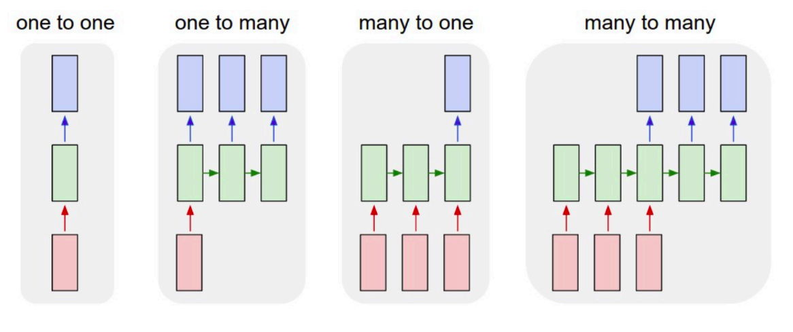

---

## Esquema original

* Modelo de **Elman**: la red mantiene un estado interno $h_t$ que se va actualizando en cada iteración

\begin{equation}
h_t = f_W ( h_{t-1}, x_t)
\end{equation}

* En concreto, un posible diseño es

\begin{align}
h_t &= \tanh (W_{hh}h_{t-1} + W_{xh}x_t) \\
y_t &= W_{hy} h_t
\end{align}

* Los **pesos se reutilizarn en cada instante $t$**:

  * aprende patrones independientemente de su posición.
  
  * reducción en el número de parámetros.

* Podemos desarrollar la recurrencia a lo largo de $t$ (ver siguientes):

---

## Grafo computacional

* Ejemplo de arquiectura **many-to-one** (ej: asignar sentimiento (+ ó -) a un tweet (secuencia de palabras))

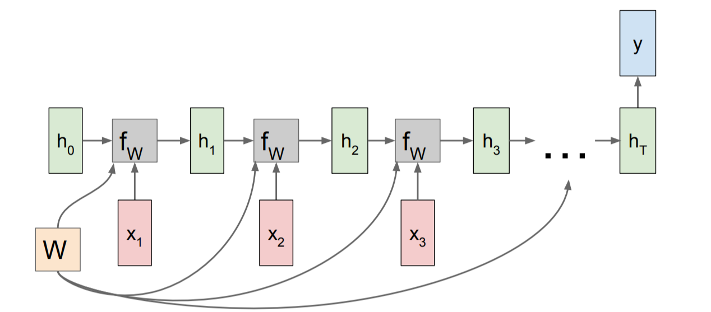

---

## Grafo computacional

* Ejemplo de arquiectura **many-to-many** (ej: predicción de una señal: en cada $x_t$ predecimos $x_{t+1}$ con el valor $y_t$))

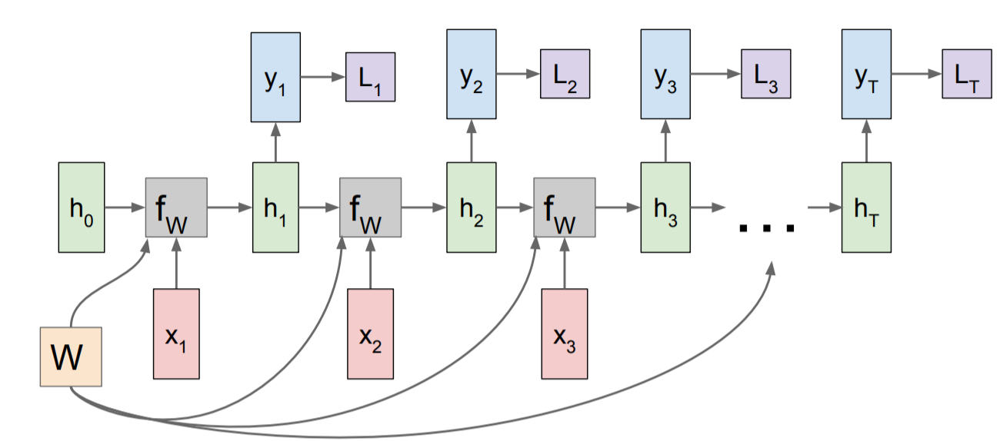

---

## Ejemplo (many to many)

* Predicción del siguiente carácter.

* Representamos cada carácter mediante OHE, nuestro vocabulario es: h, e, l, o $\in \lbrace 0, 1 \rbrace^4$.

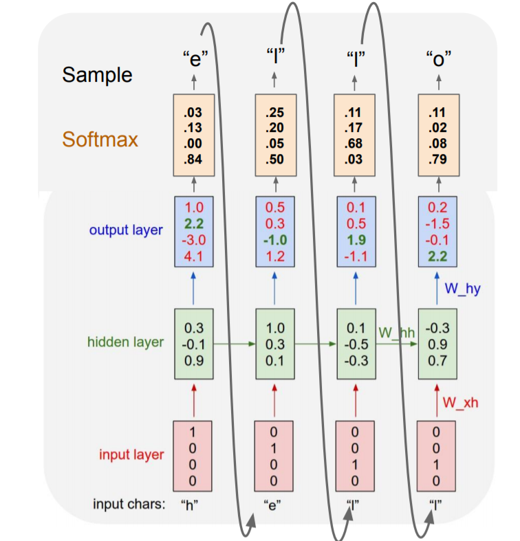

---

## Entrenamiento

* Mismo esquema de backpropagación que para las redes estándar, solo que ahora se propaga hacia atrás en el tiempo (como si la RNN estuviera desenrrollada).

* Para mejorar la estabilidad, solo se propaga hacia atrás un número de pasos limitado (**truncated backpropagation**)

* SGD o Adam.

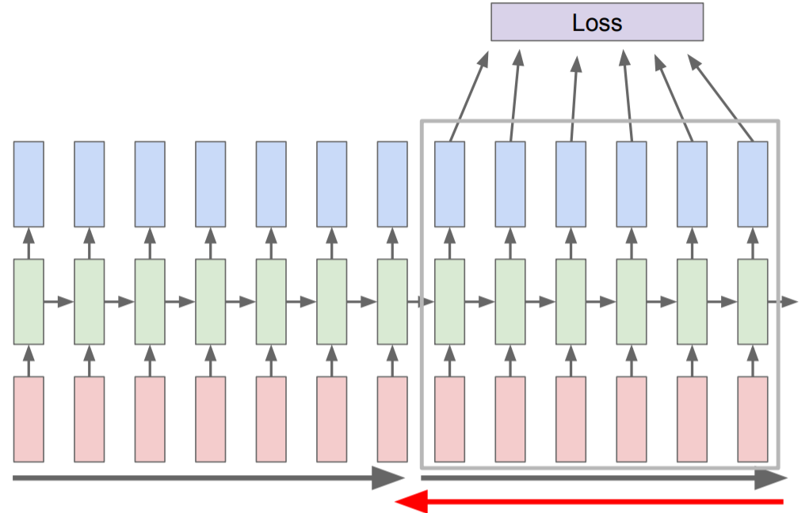

---

## Problema de la RNN original (1)

* La backpropagación desde $h_t$ a $h_{t-1}$ necesita multiplicar por $W$.

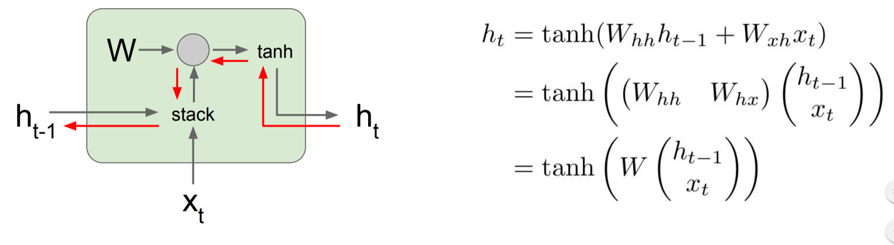

* Al hacerlo a lo largo del tiempo:

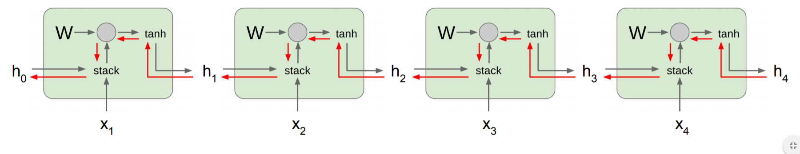

* Calcular el gradiente para $h_0$ implica multiplicaciones de $W$.

---

## Problema de la RNN original (2)

* Calcular el gradiente para $h_0$ implica multiplicaciones de $W$:

  * El mayor valor singular (autovalor) de $W$ es $> 1$: explosión del gradiente.
    
      * Solución: acotar manualmente el gradiente (**gradient clipping**).
      
  * El mayor valor singular (autovalor) de $W$ es $< 1$: desvanecimiento del gradiente.
  
      * Solución: nueva arquitecturas (LSTM, GRU).

---

## Long-Short Term Memory network (LSTM)

* Introducidas por Hochreiter en 1997, aunque no se usaron mucho hasta esta década (aplicaciones en NLP).

* Añadimos un nuevo estado (cell, $c_t$) y varias compuertas (gates) para mejorar el flujo del gradiente.

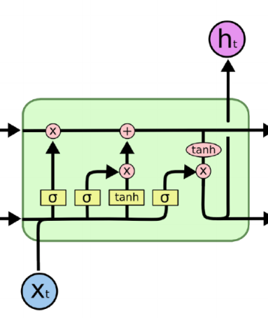

---

## LSTM (2)

* Compuerta de **olvido** (forget).

* Decide qué partes olvidar del estado anterior.

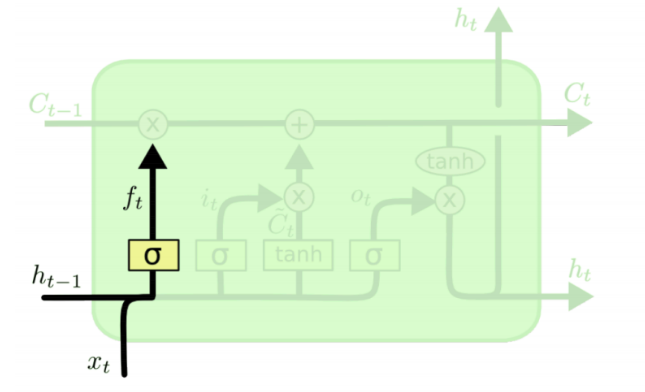

\begin{equation}
f_t = \sigma (W_f \left[ h_{t-1}, x_t \right] + b_f)
\end{equation}

---

## LSTM (3)

* Compuerta de **actualización** (update).

* Decide qué modificar para el nuevo estado.

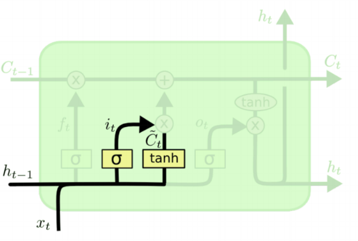

\begin{align}
i_t &= \sigma (W_i \left[ h_{t-1}, x_t \right] + b_i) \\
\tilde{C}_t &= \tanh (W_C \left[ h_{t-1}, x_t \right] + b_C)
\end{align}

---

## LSTM (4)

* Compuerta de **salida** (output)

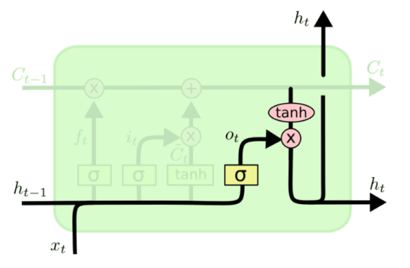

\begin{align}
o_t &= \sigma (W_o \left[ h_{t-1}, x_t \right] + b_o) \\
h_t &= o_t * \tanh (C_t)
\end{align}

---

## LSTM en resumen

* Las ecuaciones completas son

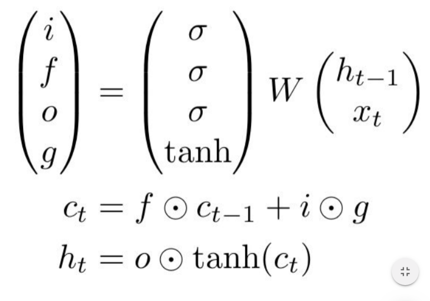

* Ahora para hacer backpropagación de $c_t$ a $c_{t-1}$ no hace falta multiplicar por $W$!!

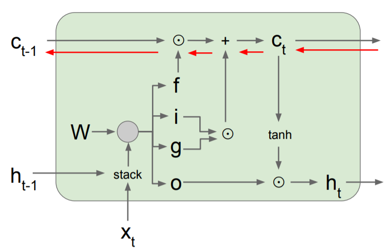

---

## Resumen

* Las RNNs permiten gran flexibilidad en el diseño de la arquitectura.

* Las RNNs originales son simples pero no funcionan bien.

* Más común: utilizar **LSTM**  para "mejorar" el gradiente.

* El flujo de gradiente hacia atrás puede explotar o desvanecerse en las RNNs: la **explosión** se controla acotando el gradiente (clipping). El **desvanecimiento** mediante conexiones aditivas (LSTM).

* Las búsqueda de arquitecturas más simples es área de investigación actual.

* Todavía hay escasos avances teóricos, se necesita más investigación.

* Las **gated recurrent units** (GRU) son algo más sencillas aunque siguen el mismo mecanismo de compuertas (https://www.aclweb.org/anthology/D14-1179)

---

class: middle, center, inverse

# Aplicación de RNNs a Procesamiento de Lenguaje Natural

---

## Cambio de paradigma

* Pre 2000s: **simbólico, basado en reglas**

  * Lenguaje entendido como conjunto de elementos y reglas para combinarlos.
  * Gramáticas independientes de contexto (Chomsky).
  * Más adecuado a lenguajes artificiales (de programación) que naturales (humanos).
  

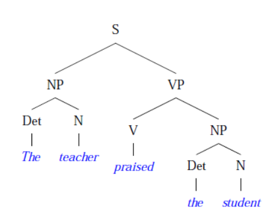

  
* Después: **estadístico, basado en datos**

  * Lenguaje entendido como probabilidades de secuencias de palabras.
  * Cálculo de frecuencias de palabras, n-gramas, etc.
  * Más adecuado a lenguajes naturales que artificiales.
  * Combinación con modelos profundos: **estado del arte**.

---

## De n-gramas a word embeddings (1)

* **Bag of words**: contamos la aparición (o frecuencia) de cada palabra: El atento alumno $\rightarrow$ (El), (atento), (alumno).

* Representaríamos la frase como 

$$
\left(0 , \ldots, 1, 0, \ldots, 0, 1, 0, \ldots, 1, 0 \right) \in \lbrace 0, 1 \rbrace^{|V|}
$$

* donde $|V|$ es el número de palabras de nuestro vocabulario $V$.

* Problema: no tiene en cuenta el orden (y contexto) de las palabras. Solución (parcial):

* **2-gramas**: contamos ahora pares consecutivos de palabras: (El, atento), (atento, alumno).

* Ahora la representación es sobre $\lbrace 0, 1 \rbrace^{|V|^2}$.

--

* **n-gramas**: explosión combinatoria...

* Ha sido lo estándar hasta $\sim 2013$. ¿Podemos encontrar una representación más compacta?

---

## De n-gramas a word embeddings (2)

* Cada palabra (representada mediante OHE) se mapea a un espacio continuo: $\lbrace 0, 1 \rbrace^{|V|} \rightarrow \mathbb{R}^m$.

* Mediante una transformación lineal $z_i = E w_i$ donde $E$ es una matriz de tamaño $m \times |V|$. Típicamente $m = 300 << |V|$.

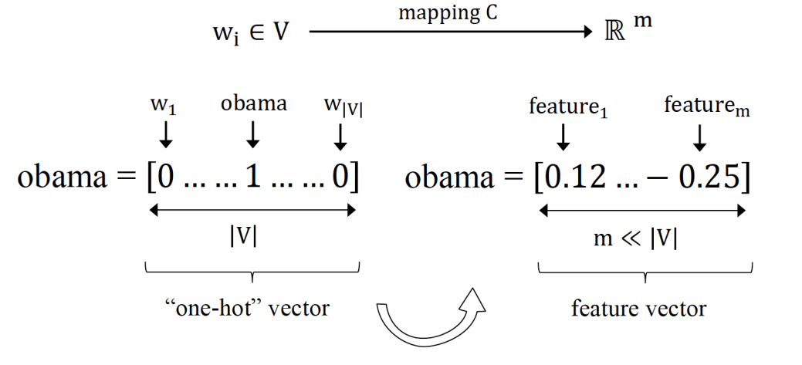

* **Combaten la catástrofe de la dimensionalidad**, mediante una compresión de los datos, pasando de un espacio discreto a uno continuo.

* Al proyectar a un espacio continuo, esperamos que palabras parecidas (sinónimos) se encuentren cerca (bajo la métrica euclidea).

---

## Álgebra lineal en el espacio de palabras (1)

* **One-hot encoding**: no hay noción de vecindad entre palabras, cualquier palabra está igual de lejos que las demás.

* **Word embeddings** (codificación densa): podemos usar la distancia euclídea (u otras) en $\mathbb{R}^m$.

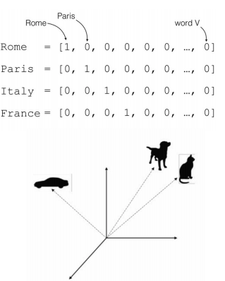

---

## Álgebra lineal en el espacio de palabras (2)

* Como estamos en un espacio vectorial ( $\mathbb{R}^m$ ), podemos realizar operaciones con vectores (word embeddings).

* Aprenden ciertas analogías entre palabras.

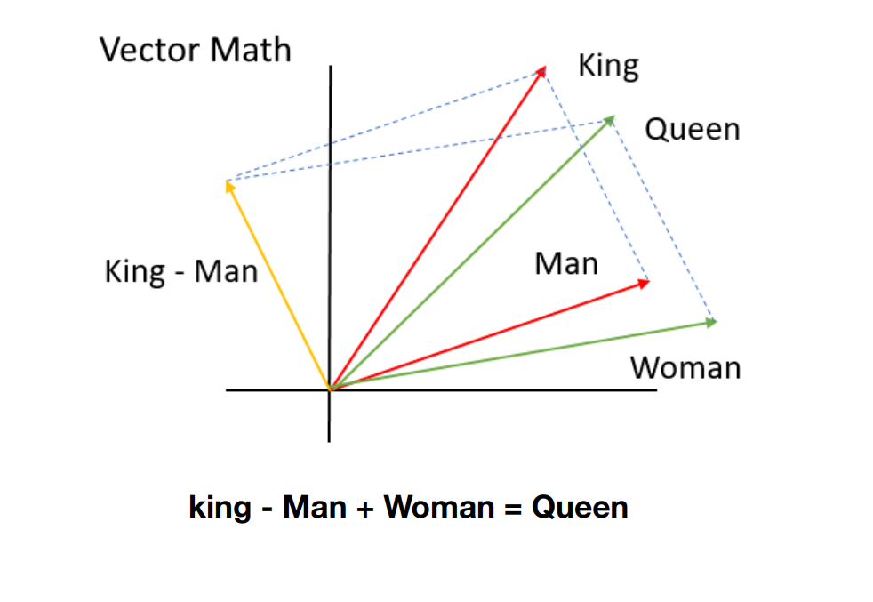

---

## word2vec (2013)

* La pregunta del millón: **¿cómo obtener la matriz $E$ de word embeddings?**

--

* Basado en la **hipótesis distribucional** del lenguaje (J. Firth 1957): el significado de una palabra puede inferirse a partir del contexto (palabras vecinas en las que aparece)

* El modelo word2vec presenta dos variantes:

  * **CBoW**: dado un contexto, predecir palabra central.
  
  * **Skip-gram**: dada la palabra central, predecir el contexto.

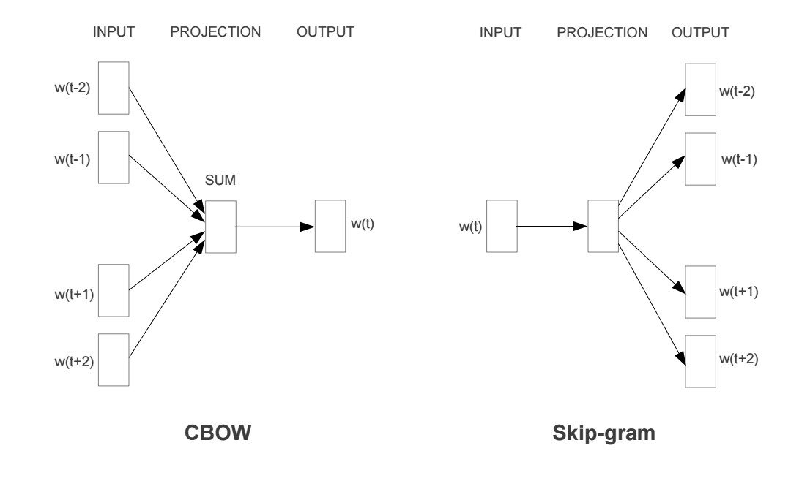

---

## Uso de embeddings preentrenados

* Aunque los embeddings pueden inicializarse aleatoriamente (como los pesos de una red neuronal estándar) y aprenderse durante la tarea,

* Una técnica habitual es cargar unos **word embeddings preentrenados**, para ahorrar tiempo y datos.

* Una vez ya tenemos los embeddings, se los acoplamos a cualquier modelo (regresión logística, red neuronal) y procedemos con el entrenamiento.

* https://fasttext.cc/ mejora de word2vec (contiene información de prefijos y sufijos).

* https://fasttext.cc/docs/en/crawl-vectors.html en castellano, entrenados sobre los artículos de la Wikipedia y CommonCrawl.

---

## Generación de textos

* https://openai.com/blog/better-language-models/

* GPT-2 es un modelo de lenguaje entrenado sobre un corpus de 40GB de datos (8 millones de páginas webs).

* La versión grande del modelo consta de 1500 millones de parámetros.

* Generación de historias online en https://talktotransformer.com/

---

## Traducción automática

* Modelos **seq2seq**: composición de many-to-one + one-to-many.

* $x_1, \ldots, x_T$ es la frase en el idioma original.

* $y_1, \ldots, y_{T'}$ es la frase en el idioma de destino.

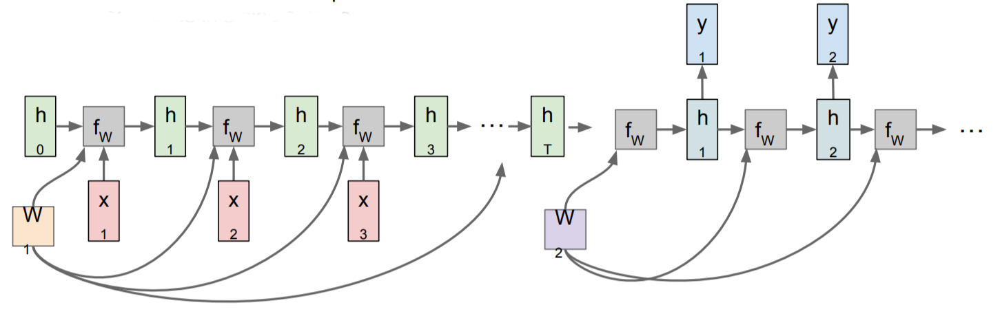

* Sequence to Sequence Learning with Neural Networks: https://arxiv.org/abs/1409.3215

* Actualmente usado en **Google Traslate**: https://ai.google/research/pubs/pub45610
---

## Subtitulación de imágenes

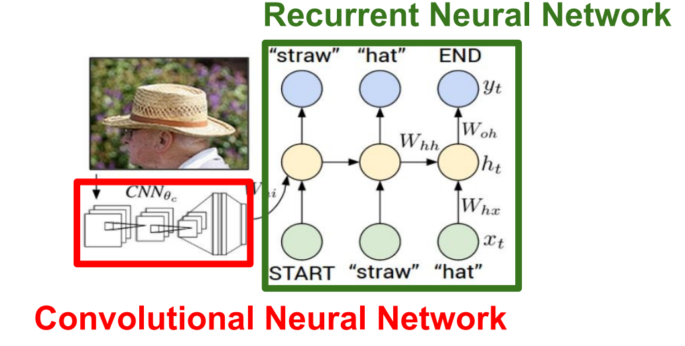

* Explain Images with Multimodal Recurrent Neural Networks: https://arxiv.org/pdf/1410.1090.pdf

* Show and Tell: A Neural Image Caption Generator: https://arxiv.org/pdf/1411.4555.pdf

